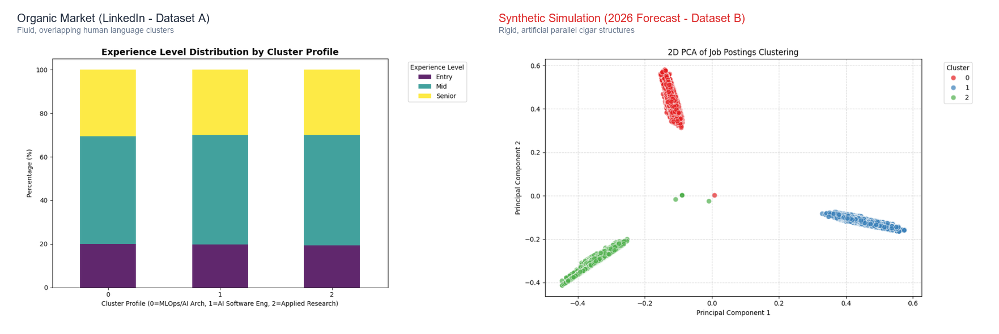
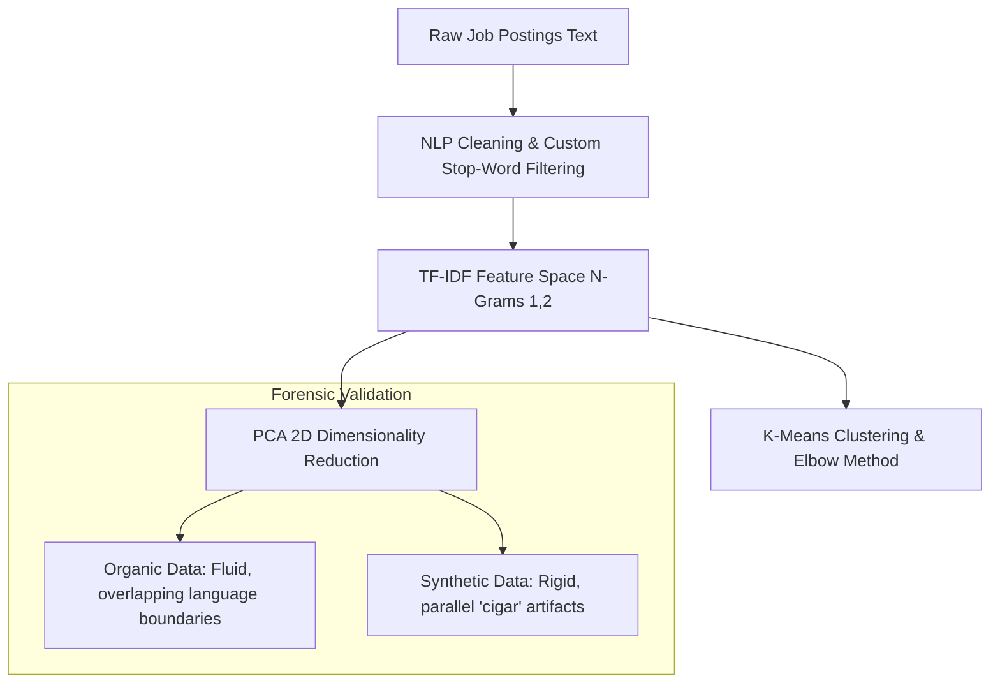
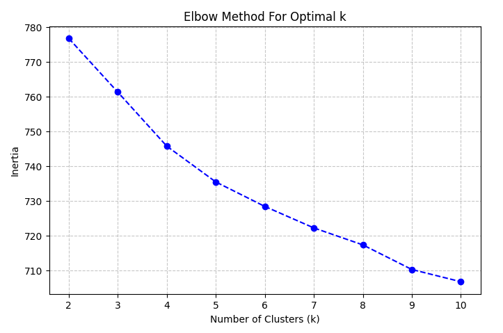
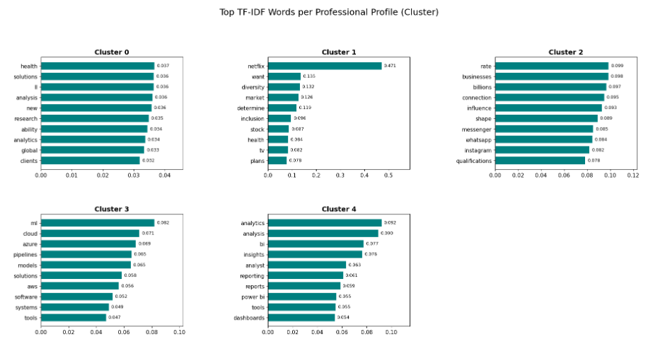
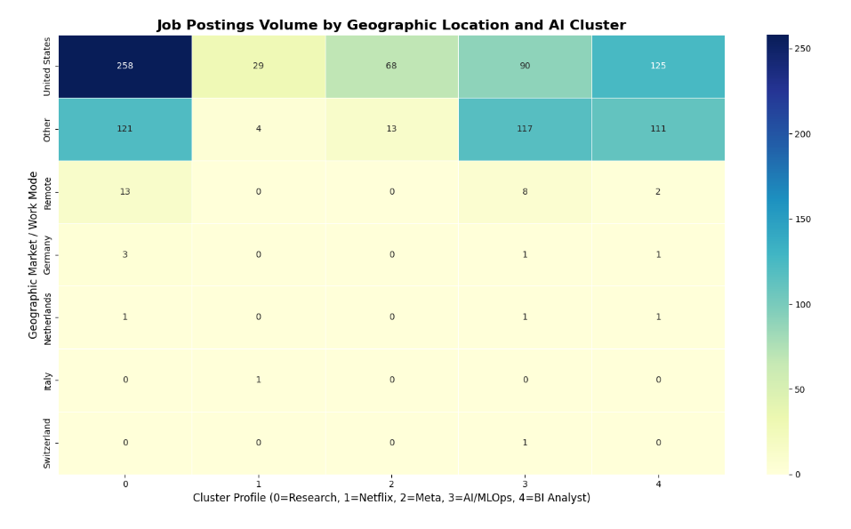
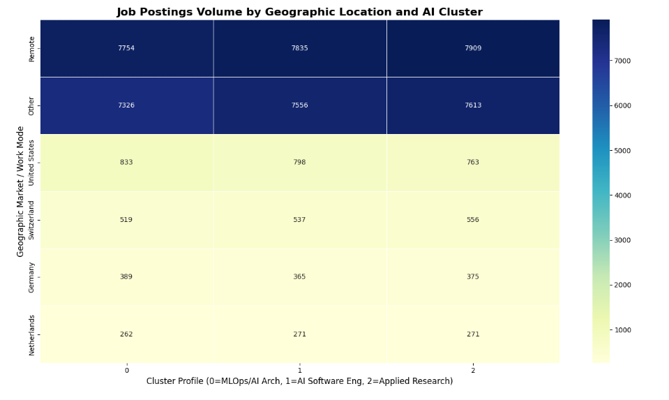

<div align="center">

# 🧠 The Polarization of Latent Skills in the AI Labor Market
### *A Computational Social Research Approach to Cognitive Labor Fragmentation & Epistemological Validity*

[](https://www.python.org/)
[](https://opensource.org/licenses/MIT)
[](https://scikit-learn.org/)
[](https://scikit-learn.org/)
[](docs/Paper_Social_Research_Mergoni.docx)

<br/>

<!-- Hero Comparison Banner -->


</div>

---

## 📌 Executive Summary

The traditional, monolithic role of the **"Data Scientist"** is undergoing profound structural fragmentation driven by advances in Generative AI and Foundation Models. What was once a unified profession is now polarizing into hyper-specialized occupational archetypes.

Building on the sociological frameworks of **Skill-Biased Technological Change** (*Acemoglu & Autor, 2011*) and **The Network Society** (*Castells, 2010*), this research applies an unsupervised computational NLP pipeline to uncover the latent skill configurations demanded by employers, while presenting a **critical methodological critique on the epistemological validity of synthetic vs. organic datasets**.

---

## 🔬 Key Research Findings

### 1. The Five Archetypes of the Organic Market
By applying **TF-IDF Vectorization** and **K-Means Clustering ($k=5$)** on organic LinkedIn recruitment traces, five distinct occupational archetypes emerge:

| Archetype | Key Latent Skills & Terminology | Sociological Classification |
| :--- | :--- | :--- |
| **Cluster 4: MLOps & AI Infrastructure** | `scale pipelines`, `cloud deployment`, `retrieval systems`, `RAG`, `inference optimization` | 👑 **The Technocratic Elite** (Frontier Infrastructure) |
| **Cluster 3: Legacy BI & SQL Analytics** | `dashboards`, `SQL queries`, `reporting`, `KPIs`, `business analysis` | 📉 **The Data Proletariat** (Vulnerable to Automation) |
| **Cluster 1: Applied Research & AI Strategy** | `research`, `state-of-the-art`, `prototyping`, `hybrid business strategy` | 🔬 **Hybrid Bridge** (R&D to Business) |
| **Clusters 0 & 2: Big Tech & Enterprise Core** | `enterprise scale`, `cross-functional`, `large-scale governance`, `corporate standards` | 🏢 **Organizational Gatekeepers** |

---

### 2. Methodological Critique: Exposing Synthetic LLM Data via PCA
A central contribution of this project is forensic dataset validation. Comparing organic LinkedIn traces against the popular synthetic *"AI Jobs Dataset 2026"* revealed profound structural distortions:



- **Organic Reality (Dataset A):** PCA projections show fluid, amorphous clusters reflecting the natural overlap and ambiguity of human recruitment language.
- **Synthetic Simulation (Dataset B):** PCA projections collapse into geometrically perfect, parallel **"cigar-shaped"** point clouds. Human language never yields zero-variance boundaries—proving mathematically that Dataset B was artificially hallucinated by an LLM prompt.
- **The Decoupling Illusion:** Synthetic datasets exhibit uniform, randomly distributed salaries and flat seniority ratios across all clusters, masking real-world wage inequality and geographic concentration.

---

## 📊 Visual Evidence & Empirical Results

<div align="center">

### Elbow Method & Cluster Keyword Profiles

| Optimal $k$ Selection (Organic Market) | Dominant Latent Skills by Cluster |
| :---: | :---: |
|  |  |

### Geographic Reality vs. Remote Myth

| Real-World Geographic Concentration (Dataset A) | Synthetic Remote Utopia Simulation (Dataset B) |
| :---: | :---: |
|  |  |

</div>

---

## 🏗️ Repository Architecture

```text
ai-labor-market-polarization/
│
├── assets/                    # High-res figures, PCA comparisons, and plots
├── data/                      # Dataset documentation and download instructions
│   └── README.md
├── docs/                      # Academic research paper and presentation deck
│   ├── Paper_Social_Research_Mergoni.docx
│   └── The_Polarization_of_Latent_Skills_in_the_AI_Labor_Market.pptx
├── notebooks/                 # Clean, annotated Jupyter research notebooks
│   ├── 01_organic_linkedin_analysis.ipynb
│   └── 02_synthetic_dataset_critique.ipynb
├── src/                       # Modular production-ready Python package
│   ├── __init__.py
│   ├── config.py              # Centralized hyperparameters and stop words
│   ├── preprocessing.py       # Regex NLP cleaning and metadata parsers
│   ├── modeling.py            # TF-IDF, KMeans clustering, and PCA
│   └── visualization.py       # Publication-quality plotting utilities
├── run_analysis.py            # Command-line pipeline execution entrypoint
├── requirements.txt           # Dependency specifications
├── LICENSE                    # MIT License
└── README.md                  # Project documentation
```

---

## 🚀 Quickstart & Installation

### 1. Clone the Repository
```bash
git clone https://github.com/Alby1224/ai-labor-market-polarization.git
cd ai-labor-market-polarization
```

### 2. Set Up Virtual Environment
```bash
# Create environment
python -m venv venv

# Activate on Windows:
.\venv\Scripts\activate

# Activate on macOS/Linux:
source venv/bin/activate
```

### 3. Install Dependencies
```bash
pip install -r requirements.txt
```

---

## 💻 Usage

### Run via Command-Line Interface (CLI)
You can execute the entire preprocessing, clustering, PCA projection, and visualization pipeline via `run_analysis.py`:

```bash
# Analyze Organic LinkedIn Dataset
python run_analysis.py --dataset organic --input data/raw/linkedin_jobs.csv --output_dir assets

# Analyze Synthetic Dataset
python run_analysis.py --dataset synthetic --input data/raw/ai_jobs_2026.csv --output_dir assets
```

### Run via Jupyter Notebooks
For interactive step-by-step exploration, launch Jupyter:
```bash
jupyter notebook notebooks/
```
- Open `01_organic_linkedin_analysis.ipynb` for the organic market segmentation.
- Open `02_synthetic_dataset_critique.ipynb` for the synthetic artifact dissection.

---

## 📚 Academic Citation & Documentation

The full theoretical framing, methodology, and sociological discussion are available in the included research paper:

> **Mergoni, A. (2026).** *The Polarization of Latent Skills in the AI Labor Market: A Computational Social Research Approach.*  
> Available in [`docs/Paper_Social_Research_Mergoni.docx`](docs/Paper_Social_Research_Mergoni.docx).

---

## 🛠️ Tech Stack & Methods

- **Language:** Python 3.10+
- **NLP & Unsupervised Learning:** Scikit-Learn (TF-IDF, K-Means, PCA)
- **Data Engineering & Manipulation:** Pandas, NumPy, SciPy
- **Visualization:** Matplotlib, Seaborn
- **Theoretical Foundations:** Skill-Biased Technological Change (SBTC), Computational Digital Sociology

---

## 📄 License

This project is licensed under the **MIT License** — see the [LICENSE](LICENSE) file for details.
